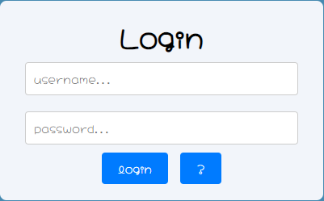
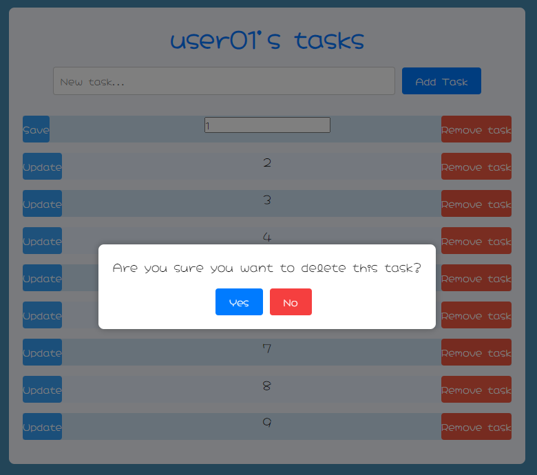
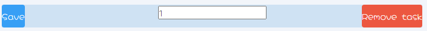

# Todo App

This is a simple todo application built with React.

## Features

- Add new tasks
- Remove tasks
- Update tasks

## Screenshots

1. Login Form
   

2. Remove Selected Task
   

3. Screen After Login
   

4. Updating Selected Task
   

## Usage

1. Clone the repository.
2. Install dependencies using `npm install`.
3. Run the development server using `npm start`.
4. Access the app in your browser at `http://localhost:3000`.

## Credits

This project is created by Ahmet Yilmaz.

## License

This project is licensed under the [MIT License](LICENSE).
